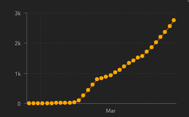

# Covid19DatabaseTutorial

Vi skal arbejde med det underliggende data der ligger under visualiseringen af covid-19, [(CSSE), Johns Hopkins University Hospital](https://www.arcgis.com/apps/opsdashboard/index.html#/bda7594740fd40299423467b48e9ecf6)

### øvelse
I skal undersøge informationen på websitet.
* Lav en liste med de informationer I kan finde,(lande, antal smittede, ).
* Beskriv hvordan informaitonerne bliver repræsenteret.
* Beskriv interaktionen, hvordan vælger brugeren og hvilke informationer kommer der.


## Tre-lags-arkitektur, (kilde [iftek](http://iftek.dk/leksikon:tre-lags-arkitektur))
I en trelagsarkitur indeles et program i tre lag, hvilket er er nyttigt i implementeringen af programmer, da de tre lag så vidt mulig holdes adskilte og dermed er hele programmet lettere at overskue.

*Præsentationslag:* Det øverste lag der håndterer modtagelse og præsentation af data. Dette lag er kendetegnet ved at være ”tæt” på brugeren af programmet.
*Logiklag:* Det midterste lag der håndterer udvekslingen af data mellem præsentationslaget og datalaget.
*Datalag:* Det nederste lag der opbevarer og håndterer data. Dette lag er også kendetegnet ved at være ”tæt” på computeren.

*Datalaget* er her en database som er lagt offentligt tilgængelig på Github
 [github.com antal dødsfald](https://github.com/CSSEGISandData/COVID-19/blob/master/csse_covid_19_data/csse_covid_19_time_series/time_series_covid19_deaths_global.csv)
[githob.com antal smittede](https://github.com/CSSEGISandData/COVID-19/blob/master/csse_covid_19_data/csse_covid_19_time_series/time_series_covid19_confirmed_global.csv)

*Logiklaget* behandler data.


eks.
pseudokode til valg af Færøerne:
```
Hvis mus klik med koordinaterne (-6.92,61) vis data fra række 94 fra datasæt `github.com antal dødsfald` og `github.com antal smittede`
```

I *Præsentationslaget* bliver resultatet af logiklaget vist.
eks.




### Øvelse
* Find Spanien i datasættet, man kan søge og undersøg hvad der er i datalaget.
* Skriv speudokode til at vælge spanien fra venstre kolonne på websiden.
* Hvilke informationer vises i *præsentationslaget*?


## Github datastruktur
Github ordner sin data i en biblioteksstruktur med 'repositor' som overmappe og subrepositories som undermapper.

Master repositori for covid-19 datamaterialer er [github covid-19](https://github.com/CSSEGISandData/COVID-19).

Master repositori har en `README.md` fil hvor repositoriet bliver forklaret.

### Øvelse
*   Undersøg mappestrukturen for  [github covid-19](https://github.com/CSSEGISandData/COVID-19).
* Læs `README.md` filen.
* Hvornår er subrepositories sidst opdateret.
* Hvornår er datasættet time_series_covid19_deaths_global.csv sidst opdateret og hvordan er det opdateret?


## Github csv datasets
CSV, comma separated values, data er en simpel struktur hvor værdier bliver adskilt af komma. Det bruges i regneark og til simpel overførsel af data. Github viser filerne som et regneark, men mulighed for at søge i det.

De forskellige datasæt eks `antal smittede` og `antal døde` kan ses som en database. For at kunne trække værdier fra forskellige datasæt skal hver række i datasættet have et unikt navn, kaldet en **nøgle**.

### Databases elemente
* **nøgle**, unik identifikation.
* **Entiteter**, data som er konstant, persons navn, firma, bil.
* **Attributter**, data som knytter sig til Entiteterne.
* **Relationer**, relationer mellem entiteter.


### Øvelse
* Angiv nøgle, Entiteter og Attributter for datasættet [covid-19 death](https://github.com/CSSEGISandData/COVID-19/blob/master/csse_covid_19_data/csse_covid_19_time_series/time_series_covid19_deaths_global.csv#L8)
* Overvej problemer i forhold til at medtage flere regioner eller lande.
* Beskriv hvilken information tabellens første række, header, angiver.
Løsning, **nøgle**, rækkenummer i tabellen, **Entiteter**, lande eller regioner, **Attributter**, koordinater og antal smittede

Vi får brug for data rent i csv format, Det kan gøres ved `Raw` knappen.

## Undersøgelse og visualisering af data
Vi vil bruge javaScript biblioteket P5.js til at visualisere data.

Onlineværktøjet [https://teddavis.org/p5live/](https://teddavis.org/p5live/) gør det muligt at skrive kode sammen på forskellige computere.

### SHORTCUTS
* CTRL + enter » run code
* CTRL + E » editor toggle
* CTRL + M » menu toggle
* CTRL + - » decrease fontsize
* CTRL + + » increase fontsize
* CMD  + A » mark all code
* CMD  + C » copy code

### opsætning
* I settings skal I fjerne 'Live Coding', så programmet ikke automatisk kører jeres kode. Hvis I er i gang med at lave en løkke kan det få programmet til at gå ned.
* Programmet kører i browseren og den letteste måde at gemme er at markere alt teksten og kopiere den over i en tekst editor på computeren.


### eksempel


## Indlæsning af data

Vi starter med js filen [ExploreData.js](ExploreData.js).

### Worked example
* Find javaScript consollen i browseren og aflæs antallet af rækker og søjler.
* Udkommenter linje 16 og 17, hvad får I?
*
